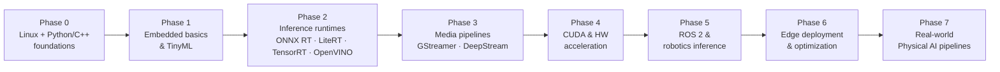

<!--
  BEFORE YOU PUBLISH:
  1. Badges and links are configured for `Premchand006`.
  2. Replace social-preview image in repo Settings → "Social preview" for nice link unfurls.
  3. Add the GitHub topics listed in awesome-resources/README.md (Settings → Topics).
-->

<div align="center">

# Physical AI & Edge AI Stack [](https://awesome.re)

### From sensor → inference → actuation — across Jetson, Raspberry Pi + Hailo, RK3588, OpenVINO, ONNX Runtime, LiteRT, ROS 2, and more.

*A cross-vendor, opinionated knowledge hub for **Physical AI, Edge AI, and Embedded AI** — covering **10+ hardware platforms**, **6+ inference runtimes**, a **Phase 0→7 learning roadmap**, **reproducible starter projects**, and a **curated awesome list**. Everything is verified current to 2026, with the **2024–2026 renames and deprecations** tracked so you never follow a dead-end tutorial.*

[](LICENSE)
[](https://creativecommons.org/licenses/by/4.0/)
[](CONTRIBUTING.md)
<br/>
[](.github/workflows/link-check.yml)
[](.github/workflows/awesome-lint.yml)
[](https://github.com/Premchand006/awesome-embedded-ai-stack/commits/main)
[](https://github.com/Premchand006/awesome-embedded-ai-stack/stargazers)

</div>

---

> [!NOTE]
> **The edge-AI landscape moved a lot in 2024–2026.** This repo tracks the changes so you don't have to. TensorFlow Lite is now **LiteRT**; Google **Coral / Edge TPU is effectively discontinued**; the Raspberry Pi **AI Kit was replaced by the AI HAT+ / AI HAT+ 2**; **Jetson AGX Thor** shipped; and the current ROS 2 LTS is **Lyrical Luth**. See [**Renames & Deprecations →**](renames-and-deprecations.md) before you buy hardware or pick a runtime.

## 📖 Table of Contents

- [🎯 What This Hub Solves](#-what-this-hub-solves)
- [🧩 What is Physical AI and Edge AI?](#-what-is-physical-ai-and-edge-ai)
- [🚀 Start Here](#-start-here)
- [🧭 Learning Roadmap](#-learning-roadmap)
- [🔌 Hardware at a Glance](#-hardware-at-a-glance)
- [🧰 Which Runtime Should I Use?](#-which-runtime-should-i-use)
- [📚 Repository Structure](#-repository-structure)
- [🔁 Renames and Deprecations](#-renames-and-deprecations)
- [🤝 Contributing](#-contributing)
- [📞 Support and Community](#-support-and-community)
- [🙏 Acknowledgements](#-acknowledgements)
- [⭐ Support This Project](#-support-this-project)
- [📄 License](#-license)

> Welcome 👋 — whether you're buying your first accelerator or shipping a multi-sensor robot, this hub gives you a path: pick hardware, pick a runtime, build a pipeline, and follow a roadmap from foundations to Physical AI.

---

## 🎯 What This Hub Solves

*The questions that actually block people starting in edge AI — and exactly where this hub answers them.*

Physical AI and Edge AI knowledge is scattered across vendor docs, blog posts, YouTube, and one-off sample repos — each assuming you've already picked *their* stack. Worse, much of it is now **out of date** (renamed SDKs, discontinued hardware). This hub fixes three things:

### 1. Hardware & runtime selection paralysis
- **Problem**: "TOPS" marketing numbers don't map to real FPS, memory limits aren't obvious, and it's unclear which runtime works on which chip.
- **Solution**: one-screen comparison tables plus per-vendor pages with caveats. → [Hardware Landscape](hardware-landscape/) · [Runtimes & SDKs](runtimes-and-sdks/)

### 2. The "model on a bench" → "real pipeline" gap
- **Problem**: tutorials stop at a single inference call; nobody shows the camera → preprocess → inference → postprocess → action pipeline, or how to build a robot perception graph.
- **Solution**: pipeline patterns and reproducible projects you can run on hardware you can buy today. → [Edge Pipelines](edge-pipelines/) · [Beginner Quick-Wins](beginner-projects/)

### 3. Following stale, dead-end guides
- **Problem**: half the tutorials online tell you to buy a Coral or `pip install tflite-runtime` — both effectively dead.
- **Solution**: a living "what changed" page and a structured learning order. → [Renames & Deprecations](renames-and-deprecations.md) · [Knowledge Roadmap](knowledge-roadmap.md)

**Why care at all?** **Edge AI is roughly a USD 25B market in 2025, projected to reach USD 57–165B by 2030–2035** depending on scope, with computer vision the dominant application and manufacturing the fastest-growing vertical ([sources](industry-landscape/)). You're learning an in-demand skill.

---

## 🧩 What is Physical AI and Edge AI?

*The 60-second mental model before you pick hardware. Full version in [concepts-and-definitions](concepts-and-definitions/).*

- **Cloud AI** — inference in a datacenter. Maximum compute, but higher latency, and data leaves the device.
- **Edge AI** — inference **on or next to the device** producing the data. Low latency, privacy, bandwidth savings, and it works offline.
- **Embedded AI / TinyML** — inference on microcontrollers/DSPs in kilobytes of memory and milliwatts of power.
- **Physical AI** — systems that **perceive, reason about, and act in the physical world** (robots, drones, autonomous machines), increasingly driven by vision-language-action and world-foundation models running at the edge.

### 🗝️ Why on-device inference matters

- **Real-time control** — closed-loop robotics needs deterministic, bounded latency (high-end platforms target multi-sensor fusion in well under ~10 ms).
- **Privacy** — faces, license plates, and patient or factory data never leave the device.
- **Bandwidth & cost** — send *insights*, not raw video, to the cloud.
- **Availability** — it keeps working when the network doesn't.

---

## 🚀 Start Here

*New here? Follow these five steps in order.*

Physical AI and Edge AI knowledge is scattered across vendor docs, blog posts, YouTube, and one-off sample repos — each assuming you've already picked *their* stack. This hub answers the questions that actually block newcomers:

- **Which board should I buy?** → [Hardware Landscape](hardware-landscape/)
- **Which runtime should I use?** → [Runtimes & SDKs](runtimes-and-sdks/)
- **How do I build a camera → inference pipeline?** → [Edge Pipelines](edge-pipelines/)
- **What do I learn, and in what order?** → [Knowledge Roadmap](knowledge-roadmap.md)
- **What can I build *this weekend*?** → [Beginner Quick-Wins](beginner-projects/)

Why care at all? **Edge AI is roughly a USD 25B market in 2025, projected to reach USD 57–165B by 2030–2035** depending on scope, with computer vision the dominant application and manufacturing the fastest-growing vertical ([sources](industry-landscape/)). You're learning an in-demand skill.

---

## 🚀 Start Here

| Step | Do this | Go to |
|------|---------|-------|
| **1. Understand the terms** | Cloud vs Edge vs Embedded vs Physical AI — 10-minute read | [concepts-and-definitions →](concepts-and-definitions/) |
| **2. Pick a path** | Use the decision tree to choose your first board | [getting-started →](getting-started/) |
| **3. Get a quick win** | Run a real camera-detection demo on hardware you can buy today | [beginner-projects →](beginner-projects/) |
| **4. Follow the roadmap** | Beginner → advanced, phase by phase | [knowledge-roadmap →](knowledge-roadmap.md) |
| **5. Go deep** | Explore runtimes, pipelines, robotics, and the market | sections below |

**Three recommended tracks** (full detail in [getting-started](getting-started/)):

- 🟢 **Maker / lowest cost** → Raspberry Pi 5 + AI HAT+ (Hailo). [Quick-win →](beginner-projects/pi5-hailo-live-detection.md)
- 🟡 **Prototyping / robotics** → NVIDIA Jetson Orin Nano Super. [Quick-win →](beginner-projects/jetson-yolo-detection.md)
- 🔴 **Advanced / humanoid & multi-sensor** → Jetson AGX Thor + Isaac ROS. [Robotics →](robotics-and-ros2/)

---

## 🗺️ Visual Roadmap: From Zero to Physical AI



Detailed, link-by-link version: **[knowledge-roadmap.md →](knowledge-roadmap.md)**

---

## 🧭 Hardware at a glance

A starter comparison. Full per-vendor pages, caveats, and buying advice live in **[hardware-landscape/](hardware-landscape/)**. TOPS are vendor maxima at the stated precision — real throughput differs; always check independent FPS/token benchmarks.

| Platform | AI perf (vendor) | Power | On-board RAM | GenAI-capable? | Approx. price | Best for |
|---|---|---|---|---|---|---|
| **RPi 5 + AI HAT+ (Hailo-8L/8)** | 13 / 26 TOPS (INT8) | ~5 W (NPU) | — (uses Pi RAM) | ❌ | $70–110 + Pi | Lowest-cost CV, learning |
| **RPi 5 + AI HAT+ 2 (Hailo-10H)** | 40 TOPS (INT4) | ~2.5 W (NPU) | 8 GB on HAT | ✅ (small LLM/VLM) | ~$130 + Pi | GenAI-at-edge on a budget |
| **Jetson Orin Nano Super** | 67 TOPS (INT8) | 7–25 W | 8 GB shared | ✅ (small) | $249 | Prototyping, robotics entry |
| **Jetson AGX Orin** | up to 275 TOPS (INT8) | 15–60 W | 32/64 GB shared | ✅ | $$$ | Multi-camera, mobile robots |
| **Jetson AGX Thor (T5000)** | up to 2,070 FP4 TFLOPS | 40–130 W | 128 GB | ✅✅ (VLA / LLM) | $3,499 (dev kit) | Humanoids, multi-sensor fusion |
| **RK3588 boards** | 6 TOPS (INT8) NPU | ~5–10 W | board-dependent | ⚠️ (small via rkllm) | $80–200 | Cheap Linux SBC + NPU |
| **Intel Core Ultra + OpenVINO** | NPU + iGPU (varies) | laptop/edge | system RAM | ✅ | varies | x86 edge servers, GenAI + CV |
| **AMD Ryzen AI (XDNA 2)** | up to 50–60 TOPS (NPU) | laptop/embedded | system RAM | ✅ | varies | AI PCs, industrial/automotive |
| **Hailo-10H (discrete M.2)** | 40 TOPS INT4 / 20 INT8 | ~2.5 W | 4/8 GB on-module | ✅ | module | Add GenAI to an x86/ARM host |
| **Axelera Metis (M.2/PCIe)** | up to 214 / 856 TOPS | M.2/card | on-card | ⚠️ | card | High-FPS multi-stream CV |
| **Google Coral / Edge TPU** | 4 TOPS (INT8) | ~2 W | — | ❌ | ⚠️ EOL | *Legacy only — see deprecations* |

> ⚠️ **Coral / Edge TPU is effectively abandoned** (kernel driver removed from staging, no stock). Use Hailo as the practical successor. Details: [renames-and-deprecations.md](renames-and-deprecations.md).

---

## ⚙️ Which runtime should I use?

Full matrix and per-runtime pages in **[runtimes-and-sdks/](runtimes-and-sdks/)**.

| If your target is… | Reach for | Notes |
|---|---|---|
| NVIDIA GPU / Jetson | **TensorRT** + (video) **DeepStream** | DeepStream is built on GStreamer |
| Intel CPU / iGPU / NPU / Arc | **OpenVINO** (+ OpenVINO GenAI) | Model Optimizer & Open Model Zoo are deprecated → use OVC + optimum-intel |
| Qualcomm Snapdragon (Hexagon NPU) | **Qualcomm AI Hub** → LiteRT / ONNX RT / QNN | 150+ pre-optimized models |
| Microcontrollers (Arduino, ESP32, Cortex-M) | **LiteRT for Microcontrollers** (`tflite-micro`) | kilobytes–megabytes of RAM |
| Phones / mixed on-device | **LiteRT** (was *TensorFlow Lite*) | `.tflite` format unchanged |
| "Run my ONNX model anywhere" | **ONNX Runtime** (pick an Execution Provider) | CUDA, TensorRT, OpenVINO, QNN, DirectML, CoreML, WebGPU… |
| Rockchip RK3588 NPU | **RKNN-Toolkit2** / **rkllm** | convert from ONNX/PyTorch |

---

## 📚 Repository Structure

*What's in the box, and where to go next.*

```text
awesome-embedded-ai-stack/
├── getting-started/            # Day 0 → Day 7: choose a board, set it up
├── concepts-and-definitions/   # Cloud vs Edge vs Embedded; Physical AI; latency
├── hardware-landscape/         # Jetson, Pi+Hailo, RK3588, OpenVINO, AMD, discrete NPUs
├── runtimes-and-sdks/          # ONNX Runtime, LiteRT, TensorRT/DeepStream, OpenVINO, TVM
├── edge-pipelines/             # camera → preproc → inference → postproc patterns
├── robotics-and-ros2/          # ROS 2 (Lyrical/Jazzy), Isaac ROS, the "3-computer" story
├── beginner-projects/          # reproducible quick-wins with a buy-list per project
├── deployment-and-optimization/# export, quantization, profiling, cloud→edge
├── industry-landscape/         # market size, vendor map, applications by vertical
├── awesome-resources/          # the curated "awesome list" core (docs, repos, videos, papers)
├── diagrams/                   # architecture & roadmap diagrams
├── knowledge-roadmap.md        # beginner → advanced learning path
├── renames-and-deprecations.md # what changed in 2024–2026 (read this!)
└── CONTRIBUTING.md             # how to add resources / projects (with quality bar)
```

### Explore by section

- 🏁 **[Getting Started](getting-started/)** — pick your first board with a decision tree.
- 🧩 **[Concepts & Definitions](concepts-and-definitions/)** — the vocabulary, done right.
- 🔌 **[Hardware Landscape](hardware-landscape/)** — every major platform, with caveats.
- ⚙️ **[Runtimes & SDKs](runtimes-and-sdks/)** — ONNX Runtime, LiteRT, TensorRT, OpenVINO, TVM.
- 🎥 **[Edge Pipelines](edge-pipelines/)** — GStreamer, DeepStream, ROS 2 perception.
- 🤖 **[Robotics & ROS 2](robotics-and-ros2/)** — Isaac ROS, NITROS, Physical AI framing.
- 🛠️ **[Beginner Projects](beginner-projects/)** — weekend quick-wins on real hardware.
- 🚢 **[Deployment & Optimization](deployment-and-optimization/)** — quantize, profile, ship.
- 📈 **[Industry Landscape](industry-landscape/)** — market data and where it's heading.
- ⭐ **[Awesome Resources](awesome-resources/)** — the curated link collection.

---

## 🔁 Renames and Deprecations

*What changed in 2024–2026 — don't get caught following a stale guide. Full page: [renames-and-deprecations.md](renames-and-deprecations.md).*

| If a guide says… | Today it's… |
|---|---|
| "TensorFlow Lite" / `tflite-runtime` | **LiteRT** / `ai-edge-litert` (`.tflite` unchanged) |
| "buy a Coral USB Accelerator" | **abandoned** — use Hailo instead |
| "Raspberry Pi AI Kit" | **AI HAT+** or **AI HAT+ 2** |
| "Jetson Orin Nano = 40 TOPS" | **67 TOPS** ("Super", JetPack 6.2) |
| "OpenVINO Model Optimizer / Open Model Zoo" | **OVC** + Hugging Face / `optimum-intel` |
| "ONNX Runtime ArmNN EP" | **removed** (1.26) — use CPU EP (KleidiAI) or QNN |
| "ROS 2 Foxy/Galactic" | EOL — use **Lyrical Luth** or **Jazzy** (LTS) |

---

## 🤝 Contributing

This hub is only as good as the community keeps it. **Good first contributions:** add a new quick-win project, fix a broken link, add a board page, or correct a stale spec. The quality bar and step-by-step process are in **[CONTRIBUTING.md](CONTRIBUTING.md)**, and CI will run `awesome-lint` + a link checker on your PR.

**Quality standards:** authoritative or high-signal sources, currently maintained, specific links (no trailing slash), and a one-line description of *why* each resource is worth a click.

Look for [`good first issue`](https://github.com/Premchand006/awesome-embedded-ai-stack/issues?q=is%3Aissue+is%3Aopen+label%3A%22good+first+issue%22) and [`help wanted`](https://github.com/Premchand006/awesome-embedded-ai-stack/issues?q=is%3Aissue+is%3Aopen+label%3A%22help+wanted%22).

## 📞 Support and Community

- 🐛 **Issues** — report a broken link, a stale spec, or a bug via GitHub Issues (templates provided).
- 💡 **Discussions / PRs** — propose a resource or project; see [CONTRIBUTING.md](CONTRIBUTING.md).
- 🔁 **Spot something outdated?** — flagging a rename or deprecation is one of the most valuable contributions you can make.

---

## 🙏 Acknowledgements

Structure inspired by the broader [Awesome](https://awesome.re) movement and community knowledge hubs across the Jetson, OpenVINO, Hailo, ROS, and RK3588 ecosystems. All product names and trademarks belong to their respective owners; this is an independent, vendor-neutral resource.

## ⭐ Support This Project

If this hub saves you time, help others find it:

- ⭐ **Star** the repo so more builders discover it.
- 🔗 **Share** it with someone picking their first edge-AI board.
- 🤝 **Contribute** a project, a fix, or a freshly verified spec.

## 📄 License

Code/snippets: **MIT**. Curated prose, tables, and learning materials: **CC BY 4.0**. See [LICENSE](LICENSE).

---

<div align="center">

**Building toward Physical AI — one verified link at a time.**
*Vendor-neutral • Kept current • Community-curated*

</div>
