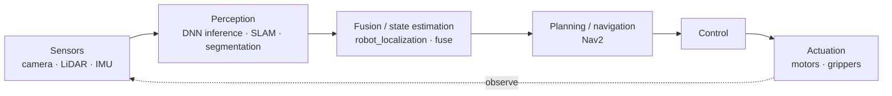

# Concepts & Definitions

The vocabulary, explained so a newcomer actually understands it. These distinctions decide which hardware and runtime you choose, so it's worth ten minutes.

## Cloud AI vs Edge AI vs Embedded AI

| | **Cloud AI** | **Edge AI** | **Embedded AI** |
|---|---|---|---|
| **Where inference runs** | Remote datacenter (GPU/TPU farm) | On or next to the device producing the data | On a tiny microcontroller/DSP |
| **Latency** | 10s–100s of ms (network round-trip) | Single-digit to low-tens of ms | Deterministic, often <1 ms |
| **Connectivity** | Required | Optional | Often none |
| **Privacy** | Data leaves the device | Data can stay local | Data stays local |
| **Compute / memory** | Effectively unlimited | A board's worth (Watts, GBs) | Kilobytes–megabytes, milliwatts |
| **Typical hardware** | A100/H100, TPUs | Jetson, Pi+Hailo, RK3588, NPUs | ESP32, Arm Cortex-M, Coral Micro |
| **Typical runtime** | PyTorch/TensorFlow serving | TensorRT, ONNX RT, OpenVINO, LiteRT | LiteRT for Microcontrollers |

**The short version:** *Cloud* maximizes compute at the cost of latency and privacy. *Edge* moves inference to where the data is born — for real-time response, privacy, bandwidth savings, and offline operation. *Embedded* is edge taken to a severe constraint: always-on intelligence in milliwatts.

These aren't rigid boxes — a Jetson is "edge," but people also call MCU work "embedded AI" or "TinyML." What matters is the **constraint envelope** (power, memory, latency) you're designing within.

## What is "Physical AI"?

**Physical AI** is AI that **perceives, reasons about, and acts in the physical world** — humanoid and mobile robots, autonomous vehicles, drones, and industrial automation. The distinguishing feature versus classic "edge inference" is that the system **closes a loop with the environment**: sense → decide → actuate → observe the result.

The term gained traction as vendors (notably NVIDIA) framed an end-to-end workflow for building such systems, and as large **vision-language-action (VLA)** and **world foundation models** started running on-device. See [robotics-and-ros2](../robotics-and-ros2/) for the "three-computer" framing (train → simulate → deploy) and world models like NVIDIA Cosmos.

## Why low latency matters

For a chatbot, 300 ms is fine. For a robot arm or a drone avoiding an obstacle, it can be the difference between working and crashing. On-device inference matters because of:

- **Real-time control loops** — closed-loop control needs deterministic, bounded latency (high-end platforms like Jetson Thor target multi-sensor fusion in well under ~10 ms).
- **Privacy** — faces, license plates, patient data, and factory IP never have to leave the device.
- **Bandwidth & cost** — streaming raw video to the cloud is expensive and often infeasible at scale; send *insights*, not *pixels*.
- **Availability** — the device keeps working when the network doesn't.

➡️ Continue to [hardware-landscape](../hardware-landscape/) to map these concepts onto real boards, or [knowledge-roadmap.md](../knowledge-roadmap.md) to start learning.
