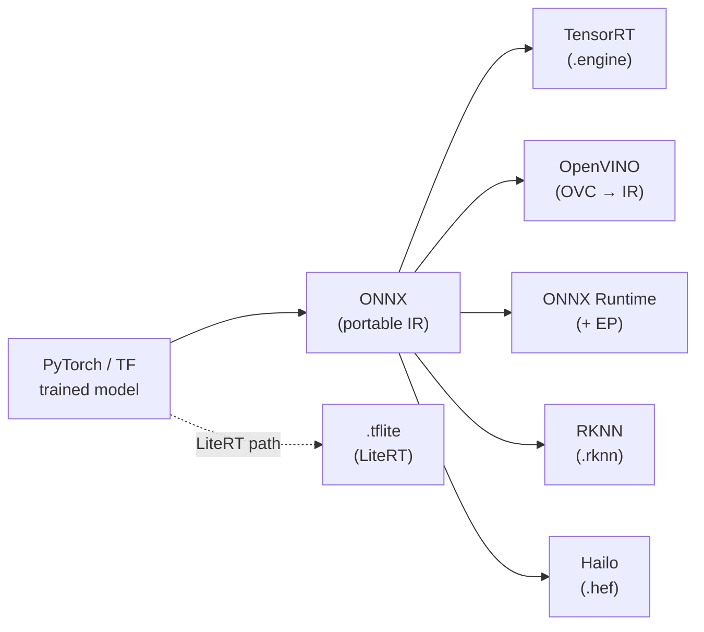

# Deployment & Optimization

The last mile: take a trained model and make it **small, fast, and shippable** on your target device — then keep it running in the field. This is where Phase 6 of the [roadmap](../knowledge-roadmap.md) lives.

## The export path
Almost every edge deployment follows the same funnel. Train in a framework, convert to a portable IR, then compile to the vendor format for your hardware.

| Target | Convert with | Output |
|---|---|---|
| NVIDIA GPU / Jetson | `trtexec` / TensorRT API | `.engine` |
| Intel CPU/iGPU/NPU | **OVC** / `openvino.convert_model()` | OpenVINO IR (`.xml/.bin`) |
| Portable | keep ONNX, pick an **EP** | runs as-is |
| Rockchip RK3588 | **RKNN-Toolkit2** | `.rknn` |
| Hailo | **Hailo Dataflow Compiler** | `.hef` |
| Phones / SBC / MCU | **LiteRT** converter | `.tflite` |

> ⚠️ Don't use OpenVINO's legacy **Model Optimizer** — it's deprecated; use **OVC** + `optimum-intel`. ([deprecations](../renames-and-deprecations.md))

## Quantization & compression (the biggest speed/size win)
Lowering numeric precision shrinks the model and speeds inference, usually with small accuracy loss.

- **Post-Training Quantization (PTQ):** quantize a trained model (often to INT8) using a small calibration set. Fast, no retraining.
- **Quantization-Aware Training (QAT):** simulate quantization during training for the best accuracy at low precision.
- **INT4 / FP4 / weight compression:** increasingly used for on-device **LLMs/VLMs** (e.g., Hailo-10H INT4, Jetson Thor FP4).

Tooling by ecosystem:

| Framework | Tool |
|---|---|
| OpenVINO | **NNCF** — `nncf.quantize()` (PTQ), weight compression, QAT |
| ONNX Runtime | **ORT quantization** (dynamic/static PTQ) |
| NVIDIA TensorRT | **TensorRT Model Optimizer** (PTQ + QAT, sparsity) |
| Rockchip | RKNN-Toolkit2 built-in quantization |
| Hailo | Dataflow Compiler optimization/quantization |

**Rule of thumb:** start with **INT8 PTQ**; if accuracy drops too far, move to QAT or keep sensitive layers at higher precision (mixed precision).

## Profiling & benchmarking
Optimize what you measure. Track three numbers on the **actual device**:
- **Latency** (ms per inference) — for real-time/control loops.
- **Throughput** (FPS, or tokens/s for LLMs) — for multi-stream analytics.
- **Power** (W) and thermals — edge devices throttle when hot.

Tools: vendor profilers (NVIDIA **Nsight**/`trtexec --dumpProfile`, OpenVINO **benchmark_app**, Hailo profiler), plus end-to-end FPS in your pipeline. Always benchmark the **whole pipeline** (decode + preprocess + inference + postprocess), not just the model — preprocessing is a common hidden bottleneck.

## Cloud → edge workflows
For fleets of devices, the pattern is: containerize the inference app, deploy/version models centrally, and monitor health/accuracy remotely. **ONNX Runtime** is a common portable choice for this; pair with your platform's device-management tooling. See [edge-pipelines](../edge-pipelines/) for the runtime pattern and [ONNX Runtime](../runtimes-and-sdks/onnx-runtime.md) for portability.

## Checklist before you ship
- [ ] Model converted to the **vendor format** for the target (not running a generic fallback by accident).
- [ ] **Quantized** (INT8 at least) and accuracy validated on real data.
- [ ] Benchmarked **on-device** for latency/FPS/power, with cooling representative of production.
- [ ] Pipeline (not just model) profiled; preprocessing optimized.
- [ ] Update/rollback path for models in the field.
