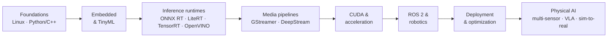

# Diagrams

Architecture and roadmap diagrams for the hub. Diagrams are authored as **Mermaid** (renders natively on GitHub, diffs cleanly in PRs). Rendered PNG/SVG exports can be added here for use in slides or external docs.

## How to contribute a diagram
- Prefer **Mermaid** in fenced ` ```mermaid ` blocks so it renders in Markdown and stays reviewable.
- If you add an image, include the **source** (`.mmd`, `.drawio`, or `.excalidraw`) alongside the export so others can edit it.
- Keep labels vendor-neutral and consistent with the rest of the repo.

## Index of diagrams in this repo
- **Learning roadmap** — [knowledge-roadmap.md](../knowledge-roadmap.md)
- **Board decision tree** — [getting-started](../getting-started/)
- **Robotics / Physical AI stack** — [concepts-and-definitions](../concepts-and-definitions/)
- **Canonical edge pipeline** — [edge-pipelines](../edge-pipelines/)
- **Three-computer Physical AI workflow** — [robotics-and-ros2](../robotics-and-ros2/)
- **Model export & optimization funnel** — [deployment-and-optimization](../deployment-and-optimization/)

## Reference: the high-level roadmap


