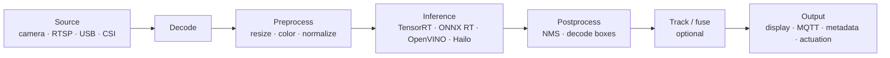

# Edge Pipelines

Getting pixels (or sensor data) from a source into a model and results back out — in real time. This is where a lot of ML engineers get stuck, because the model is the easy part; the **pipeline** is the hard part.

## The canonical pattern

Every real system is a variation on this. The questions are: *how do frames move between stages without copies?* and *how do you run many streams at once?* That's what frameworks like **GStreamer**, **DeepStream**, and **ROS 2** solve.

## Pick your pipeline framework

| Framework | Best for | Built on | Page |
|---|---|---|---|
| **GStreamer** | general video pipelines, any vendor | — | [gstreamer-and-deepstream.md](gstreamer-and-deepstream.md) |
| **NVIDIA DeepStream** | multi-stream video AI on Jetson/GPU | GStreamer | [gstreamer-and-deepstream.md](gstreamer-and-deepstream.md) |
| **Intel DL Streamer** | multi-stream video AI on Intel | GStreamer | [OpenVINO](../runtimes-and-sdks/openvino.md) |
| **Hailo TAPPAS** | Hailo accelerator pipelines | GStreamer | [Pi + Hailo](../hardware-landscape/raspberry-pi-and-hailo.md) |
| **ROS 2 perception** | robots (fuse perception with control) | ROS 2 / DDS | [robotics-and-ros2](../robotics-and-ros2/) |

> **Insight:** most edge-AI video stacks — DeepStream, DL Streamer, Hailo TAPPAS — are **GStreamer underneath**. Learn GStreamer once and the vendor layers become much easier.

## Two worlds: media pipelines vs robotics graphs
- **Media pipelines (GStreamer family):** ideal for cameras/RTSP, video analytics, smart-camera products. Linear-ish graphs of elements.
- **Robotics graphs (ROS 2):** ideal when perception must feed planning/control and fuse many sensors. Nodes exchange messages on topics; hardware acceleration via **NITROS** (type adaptation/negotiation). See [robotics-and-ros2](../robotics-and-ros2/).

## Sensor fusion (briefly)
When you combine camera + IMU + LiDAR/GPS, you need **state estimation**. In ROS the standard maintained packages are **`robot_localization`** (EKF/UKF) and the **`fuse`** stack. Concepts live in [concepts-and-definitions](../concepts-and-definitions/); robot integration in [robotics-and-ros2](../robotics-and-ros2/).

## ONNX Runtime on the edge (fleet pattern)
For non-NVIDIA or portability-first deployments, a common pattern is an **ONNX Runtime** inference module deployed and monitored across a device fleet (e.g., containerized, with remote model updates). Start from the [ONNX Runtime page](../runtimes-and-sdks/onnx-runtime.md) and the [deployment guide](../deployment-and-optimization/).

➡️ Hands-on: [RTSP / DeepStream pipeline](gstreamer-and-deepstream.md), then the [beginner projects](../beginner-projects/).
