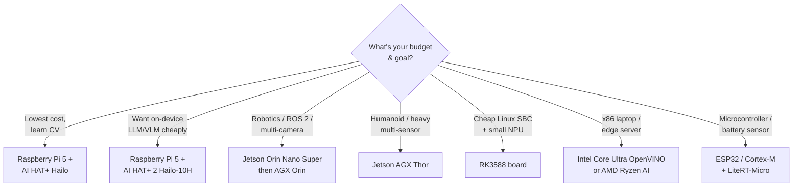

# Getting Started

**Day 0 → Day 7.** Pick a board, set it up, and run your first model. If you've never touched an edge device, start here.

## Step 1 — Know the words (10 min)
Read [concepts-and-definitions](../concepts-and-definitions/): Cloud vs Edge vs Embedded, what "Physical AI" means, and why latency matters. It'll make every later choice obvious.

## Step 2 — Choose your board (the decision tree)

There is no single "best" board — it depends on budget, whether you need robotics/ROS 2, and whether you want on-device generative AI.

### Recommendation by profile

| You are… | Buy | Why | First project |
|---|---|---|---|
| A maker / student, tight budget | **Raspberry Pi 5 + AI HAT+** | Cheapest credible NPU path; huge community | [Pi 5 + Hailo detection →](../beginner-projects/pi5-hailo-live-detection.md) |
| Curious about on-device GenAI | **Raspberry Pi 5 + AI HAT+ 2** | Hailo-10H + 8 GB runs small LLMs/VLMs locally | [Pi 5 + Hailo detection →](../beginner-projects/pi5-hailo-live-detection.md) |
| Building a robot / need ROS 2 | **Jetson Orin Nano Super ($249)** | Full NVIDIA stack: TensorRT, DeepStream, Isaac ROS | [Jetson YOLO →](../beginner-projects/jetson-yolo-detection.md) |
| Doing serious multi-camera/humanoid | **Jetson AGX Thor** | 2,070 FP4 TFLOPS, VLA-class on-device | [Robotics →](../robotics-and-ros2/) |
| Want a cheap SBC + NPU | **RK3588 board** (Orange Pi 5, etc.) | 6-TOPS NPU, low cost; rkllm for small LLMs | [RK3588 →](../hardware-landscape/rk3588.md) |
| On an x86 laptop/server | **Intel Core Ultra / AMD Ryzen AI** | Use the CPU/iGPU/NPU you already own via OpenVINO | [OpenVINO →](../runtimes-and-sdks/openvino.md) |
| Building a battery sensor | **ESP32 / Cortex-M MCU** | TinyML; milliwatts, always-on | [TinyML →](../runtimes-and-sdks/litert.md) |

> ⚠️ **Don't buy** a Google Coral / Edge TPU for a new project — it's effectively abandoned. [Why →](../renames-and-deprecations.md)

Full specs and trade-offs: **[hardware-landscape](../hardware-landscape/)**.

## Step 3 — Set it up

The exact flashing steps differ per board, so follow the **official** getting-started guide (we link the right one rather than re-host instructions that go stale):

- **Jetson** → [NVIDIA Jetson Developer Kit getting-started](https://developer.nvidia.com/embedded/learn/get-started-jetson-orin-nano-devkit) + [Jetson AI Lab](https://www.jetson-ai-lab.com/).
- **Raspberry Pi + Hailo** → [Raspberry Pi AI docs](https://www.raspberrypi.com/documentation/computers/ai.html) + [hailo-rpi5-examples](https://github.com/hailo-ai/hailo-rpi5-examples).
- **RK3588** → [airockchip / RKNN-Toolkit2](https://github.com/airockchip/rknn-toolkit2).
- **Intel/AMD x86** → [OpenVINO install](https://docs.openvino.ai/) / [AMD Ryzen AI Software](https://www.amd.com/en/developer/resources/ryzen-ai-software.html).
- **MCU** → [LiteRT for Microcontrollers](https://github.com/tensorflow/tflite-micro).

Basics you'll use on any Linux board: SSH in, update packages, check your camera (`v4l2-ctl --list-devices`), and confirm the accelerator is detected.

## Step 4 — Get a quick win
Run one project end-to-end before reading more theory. Momentum beats perfection. → **[beginner-projects](../beginner-projects/)**

## Step 5 — Follow the roadmap
Now go deep, in order: **[knowledge-roadmap.md](../knowledge-roadmap.md)**.
