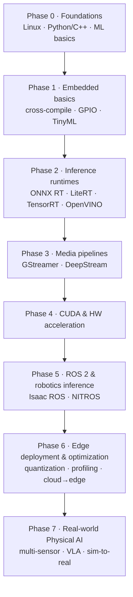

# Knowledge Roadmap: Beginner → Advanced

A concrete, phase-by-phase path for going from "I know some Python" to "I can ship a real-time, on-device AI pipeline." Each phase lists **what to learn**, **why it matters**, and **where to go next** in this repo.

You don't have to do every phase. Pick the track that matches your hardware ([getting-started](getting-started/)) and skip ahead — the phases are ordered, but they're modular.

---

## Phase 0 — Foundations
**Goal:** be comfortable on a Linux command line and understand what a neural-network model *is* before you try to deploy one.

- **Linux:** shell navigation, SSH into a headless board, `apt`/package managers, file permissions, `systemd` services, serial console (`screen`/`minicom`).
- **Programming:** Python for ML glue + enough **C/C++** to read performance-critical samples (DeepStream, TensorRT, LiteRT-Micro are C/C++).
- **ML basics:** what a tensor is; CNNs vs transformers; **classification vs object detection vs segmentation**; what "INT8" and "quantization" mean at a high level.

➡️ **Next:** [concepts-and-definitions](concepts-and-definitions/) to lock in Cloud vs Edge vs Embedded vocabulary.

## Phase 1 — Embedded systems basics
**Goal:** understand the device you're deploying to.

- **Cross-compilation & build systems** (CMake), flashing an OS image, device trees at a glance.
- **SoC vs MCU:** when you need a Linux board (Jetson, Pi, RK3588) vs a microcontroller (ESP32, Cortex-M).
- **GPIO / cameras / sensors:** CSI vs USB cameras, I²C/SPI sensors.
- **TinyML intro:** deploy a tiny model to an MCU with **LiteRT for Microcontrollers** (`tflite-micro`).

➡️ **Next:** pick a board in [getting-started](getting-started/), then do your first [quick-win](beginner-projects/).

## Phase 2 — AI inference runtimes
**Goal:** take a trained model and *run* it efficiently on a target. This is the core edge-AI skill.

- **ONNX Runtime** — the portable option; learn **Execution Providers** (CPU, CUDA, TensorRT, OpenVINO, QNN, DirectML, CoreML). [Page →](runtimes-and-sdks/onnx-runtime.md)
- **LiteRT** (formerly TensorFlow Lite) — phones/SBCs; `.tflite` format. [Page →](runtimes-and-sdks/litert.md)
- **TensorRT** — squeeze maximum throughput on NVIDIA GPUs/Jetson. [Page →](runtimes-and-sdks/tensorrt-and-deepstream.md)
- **OpenVINO** — Intel CPU/iGPU/NPU/Arc, plus OpenVINO GenAI. [Page →](runtimes-and-sdks/openvino.md)

> **The #1 beginner confusion** is "which runtime?" The honest answer: it's mostly dictated by your hardware. See the [runtime selection matrix](runtimes-and-sdks/).

## Phase 3 — GStreamer & media pipelines
**Goal:** get pixels from a camera/RTSP stream into a model and results back out, in real time.

- **GStreamer fundamentals:** elements, pads, caps, and pipelines. Build `v4l2src → videoconvert → appsink`.
- **DeepStream** (NVIDIA) — an optimized graph **built on GStreamer** for multi-stream detection/tracking. [Page →](edge-pipelines/gstreamer-and-deepstream.md)
- **Intel DL Streamer** — the OpenVINO equivalent, also on GStreamer.

➡️ **Next:** the [RTSP detection quick-win](beginner-projects/) ties this together.

## Phase 4 — CUDA & hardware acceleration
**Goal:** understand what your accelerator is actually doing (only essential if you target NVIDIA).

- **CUDA fundamentals:** streams, host↔device memory copies, why zero-copy matters.
- How **TensorRT** and **DeepStream** use CUDA under the hood (layer fusion, precision calibration).
- Accelerator-specific compilers for non-NVIDIA NPUs (RKNN, Hailo Dataflow Compiler, OpenVINO).

## Phase 5 — ROS 2 & robotics inference
**Goal:** move from "a model on a camera" to "perception inside a robot."

- **ROS 2 basics:** nodes, topics, services, composition, launch files. Use a current distro — **Lyrical Luth (LTS)** or **Jazzy Jalisco (LTS)** ([why](renames-and-deprecations.md)).
- **Perception stacks:** the `ros-perception` packages; **NVIDIA Isaac ROS** GEMs (Visual SLAM, NVBlox, DNN inference, segmentation).
- **Hardware acceleration in ROS 2:** type adaptation & negotiation (NVIDIA's implementation is **NITROS**) for zero-copy GPU pipelines.

➡️ **Section:** [robotics-and-ros2](robotics-and-ros2/).

## Phase 6 — Edge deployment & optimization
**Goal:** make it fast, small, and shippable.

- **Export path:** PyTorch → ONNX → (TensorRT / ORT / OpenVINO / RKNN / Hailo). [Guide →](deployment-and-optimization/)
- **Quantization & compression:** INT8/INT4 post-training quantization and QAT (OpenVINO **NNCF**, ONNX Runtime quantization, **TensorRT Model Optimizer**).
- **Profiling:** measure latency, throughput (FPS), and power; understand the trade-offs per platform.
- **Cloud → edge workflows:** containerize and deploy/monitor models on fleets (e.g., ONNX Runtime on edge devices).

## Phase 7 — Real-world Physical AI pipelines
**Goal:** the frontier — multi-sensor, real-time, and increasingly model-driven robots.

- **Multi-camera + sensor fusion** for robotics, industrial inspection, and video analytics.
- **Advanced platforms:** Jetson **AGX Thor** + Isaac ROS + **Holoscan** for low-latency multi-sensor processing.
- **The "three-computer" Physical AI workflow** (train → simulate → deploy) and **world foundation models** like NVIDIA Cosmos for synthetic data and VLA (vision-language-action) models. [Context →](robotics-and-ros2/)
- **Domain patterns:** predictive maintenance, smart retail analytics, autonomous drones, healthcare monitoring. [Verticals →](industry-landscape/)

---

## Suggested timelines

| Background | Realistic pace to "ship a real-time edge pipeline" |
|---|---|
| Comfortable with Linux + Python | Phases 0–3 in ~6–8 weeks part-time |
| Firmware/embedded engineer new to ML | Spend more on Phase 2; ~3 months part-time |
| ML engineer new to embedded | Spend more on Phases 1, 3, 4; ~3 months part-time |
| Robotics-focused | Fast-track to Phase 5 after a Phase 2–3 detour |

Curated learning resources for every phase: **[awesome-resources](awesome-resources/)**.
