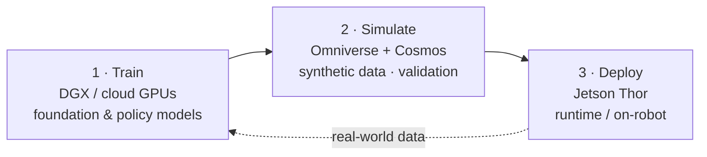

# Robotics & ROS 2

Where edge inference becomes **Physical AI**: perception feeding planning, control, and actuation, fusing multiple sensors in real time. **ROS 2** is the de-facto middleware; **NVIDIA Isaac ROS** is the leading GPU-accelerated perception stack.

## ROS 2 — pick a current LTS
- **Docs:** [docs.ros.org](https://docs.ros.org/)
- **Current LTS: Lyrical Luth** (released **May 22, 2026**, Ubuntu 24.04, supported to **May 2031**).
- **Prior LTS: Jazzy Jalisco** (May 2024, EOL 2029). **Kilted Kaiju** (May 2025) is non-LTS. **Humble** (2022) is LTS until 2027. **Rolling Ridley** is the development line.

> For a new robot, choose an **LTS** (Lyrical or Jazzy). Avoid EOL distros (Foxy/Galactic) that old tutorials assume. ([deprecations](../renames-and-deprecations.md))

**ROS 2 basics you'll need:** nodes, topics, services/actions, parameters, **composition** (run multiple nodes in one process for zero-copy), and launch files. Communication runs over **DDS**.

## Isaac ROS — accelerated perception
- **Docs/org:** [developer.nvidia.com/isaac/ros](https://developer.nvidia.com/isaac/ros) · [github.com/NVIDIA-ISAAC-ROS](https://github.com/NVIDIA-ISAAC-ROS)

Isaac ROS provides GPU-accelerated **GEMs** (packages) that drop into a ROS 2 graph:

| GEM | What it does |
|---|---|
| `isaac_ros_visual_slam` | camera-based localization & mapping |
| `isaac_ros_nvblox` | real-time 3D reconstruction for navigation |
| `isaac_ros_dnn_inference` | TensorRT/Triton inference in ROS 2 |
| `isaac_ros_image_pipeline` | accelerated rectify/resize/format |
| segmentation / object detection | accelerated perception models |

**The acceleration trick — NITROS:** ROS 2 added **type adaptation & type negotiation** so nodes can pass GPU memory without copying to/from CPU. NVIDIA's implementation is **NITROS**, which is what makes Isaac ROS pipelines fast on Jetson and x86+GPU.

Other relevant stacks: the community **[ros-perception](https://github.com/ros-perception)** packages, **Nav2** for navigation, and **`robot_localization`**/**`fuse`** for sensor fusion.

## NVIDIA Holoscan — real-time multi-sensor AI
- **Docs/org:** [developer.nvidia.com/holoscan-sdk](https://developer.nvidia.com/holoscan-sdk) · [github.com/nvidia-holoscan](https://github.com/nvidia-holoscan)

A domain-agnostic platform for **low-latency streaming sensor AI** (medical devices, industrial inspection, scientific instruments), with the **Holoscan Sensor Bridge** for high-rate I/O. Reference apps live in **HoloHub**. Use it when ROS 2's latency/throughput envelope isn't enough.

## Physical AI: the "three-computer" workflow
Vendors (notably NVIDIA) frame building robots as three cooperating computers:

- **Train** large models in the cloud (DGX).
- **Simulate** and generate **synthetic data** to cover rare/dangerous cases — increasingly with **world foundation models**.
- **Deploy** the runtime model on the robot ([Jetson Thor](../hardware-landscape/jetson.md)).

### World foundation models (Cosmos)
**NVIDIA Cosmos** ([nvidia.com/en-us/ai/cosmos](https://www.nvidia.com/en-us/ai/cosmos/), [paper arXiv:2501.03575](https://arxiv.org/abs/2501.03575)) is a family of **world foundation models** for Physical AI: **Predict** (generate future world states), **Transfer** (turn structured inputs into photoreal synthetic data), and **Reason** (vision-language reasoning). They feed the "simulate" stage and the training of **vision-language-action (VLA)** models that run at the edge. This is the frontier the field is moving toward.

➡️ Learn it in order: [knowledge-roadmap Phase 5–7](../knowledge-roadmap.md). Hardware: [Jetson](../hardware-landscape/jetson.md).
